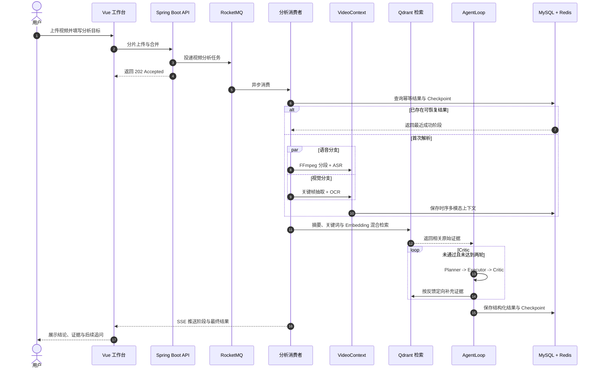

<div align="center">
  <p>
    <a href="https://github.com/Xiaoc7r/DOVideo-AI/stargazers"></a>
    
    
    
    
    
    
    
    <a href="./LICENSE"></a>
  </p>
</div>

<div align="center">

面向长视频内容理解的 <strong>Video Agent</strong>。

DoVideoAI 将长视频转化为可检索、可追溯、可继续追问的结构化知识。

系统融合 ASR 与关键帧 OCR 构建多模态 <code>VideoContext</code>，再由 Planner、Executor 与 Critic 围绕用户目标完成分析和证据校验。

</div>

## 项目预览

**登录与注册**


**视频工作台**


**Agent 目标输入**


**Agent 分析结果**


用户完成登录后，可以上传视频并在工作台管理解析任务；选择视频并输入分析目标后，Agent 会展示结构化结论、时间戳证据、执行计划、阶段轨迹与质量评估，并支持基于同一视频继续追问。

## 核心功能

### 可靠的视频任务链路

- 前端按 5 MB 分片上传，Redis 记录已完成分片，MinIO 保存合并后的视频。
- RocketMQ 将视频解析移出请求线程，Redisson 按“内容指纹 + 分析目标”控制并发与重复消费。
- 用户级和全局令牌桶限制 AI 请求速率；ASR 与模型调用采用有限次数的指数退避重试。

### 时序多模态 VideoContext

- FFmpeg 将音频按 60 秒切片，同时通过场景变化检测抽取关键帧，并以 30 秒保底采样避免遗漏静态板书。
- ASR 与 OCR 使用独立有界线程池并行执行；相邻画面通过感知哈希去重，单路失败时保留另一条有效信息。
- 语音区间、OCR 文本、关键帧与时间戳被合并为统一的 `VideoSegment`，后续检索和校验不再依赖底层模型格式。

```text
[02:00 - 03:00]
ASR      接下来讲解二叉树的前序遍历
OCR      前序遍历：根节点、左子树、右子树
Evidence frame_000125.jpg
```

### 有证据约束的 AgentLoop

- Planner 将用户目标拆成可执行任务，Executor 生成固定结构的结论、证据和建议。
- Critic 检查目标覆盖、结构完整性与时间戳证据；不通过时根据缺失内容和时间范围重新检索。
- AgentLoop 最多执行两轮，既允许定向修正，也通过轮次上限控制延迟和 Token 成本。

### 长视频检索与断点恢复

- 每 5 分钟生成片段摘要、关键词和 Embedding，通过关键词匹配与 Qdrant 语义召回选择 TopK 原始证据。
- Qdrant 或 Embedding 服务不可用时退化到本地关键词与已有向量排序，不阻断主分析链路。
- Checkpoint 以 MySQL 为恢复真源、Redis 为热缓存，持久化 `VideoContext`、分块、计划、Critic 状态和最终结果。
- 前端通过 SSE 接收任务阶段；失败消息写入独立失败主题与失败任务表，可由管理接口重新投递。

## 系统流程



## 技术栈

| 层次 | 技术 | 用途 |
| :--- | :--- | :--- |
| Web | Vue 3、Vite、SSE、Marked | 上传、Agent 工作台、实时进度与安全 Markdown 展示 |
| API | Java 21、Spring Boot 3.5.9、Undertow、MyBatis-Plus | 鉴权、媒体管理、任务编排与 REST API |
| 异步与缓存 | RocketMQ 4.9.4、Redis 7.4、Redisson | 异步削峰、状态缓存、限流、锁与消费幂等 |
| 数据与存储 | MySQL 8、MinIO、Qdrant | 业务数据、视频对象、Checkpoint 与向量检索 |
| 视频与 AI | FFmpeg、Tesseract、LangChain4j、DeepSeek、TeleSpeechASR、BGE-M3 | 音视频处理、多模态解析、Agent 推理与 Embedding |
| 部署 | Docker Compose | 本地中间件编排 |

## 本地运行

### 环境要求

| 组件 | 要求 | 说明 |
| :--- | :--- | :--- |
| JDK | 21 | 后端运行环境 |
| Node.js | 22 | Vue 与 Vite 构建环境 |
| Docker | 支持 Compose | 启动 MySQL、Redis、MinIO、Qdrant 与 RocketMQ |
| FFmpeg | 可在终端调用 | 音频切分与关键帧抽取 |
| Tesseract | 安装 `chi_sim` 与 `eng` | 中英文关键帧 OCR |
| yt-dlp | 可选 | 仅解析在线视频链接时需要 |

### 1. 准备配置

```bash
cp .env.example .env
```

编辑 `.env`，至少设置数据库、Redis、MinIO 密码和 `SILICONFLOW_API_KEY`。密钥只保存在本地 `.env`，不要提交到仓库。

### 2. 启动中间件

```bash
docker compose up -d
```

Compose 会启动 MySQL、Redis、MinIO、Qdrant、RocketMQ NameServer、Broker 与 Dashboard。

### 3. 启动后端

```bash
set -a
source .env
set +a

cd server
./mvnw spring-boot:run
```

后端默认地址为 `http://localhost:9090`，启动时会初始化项目所需数据表。

### 4. 启动前端

```bash
set -a
source .env
set +a

cd client
npm install
npm run dev
```

浏览器访问 `http://localhost:5173`。

只查看前端 Agent 工作台时，可以打开 `http://localhost:5173/?demo`。Demo 模式使用内置示例数据，不依赖后端服务。

## 目录结构

```text
DoVideoAI
├── client/              # Vue 3 工作台
├── server/              # Spring Boot API 与 Video Agent
├── rocketmq/            # Broker 配置
├── docker-compose.yml   # 中间件编排
└── .env.example         # 本地配置模板
```

## License

本项目基于 [MIT License](LICENSE) 开源。
